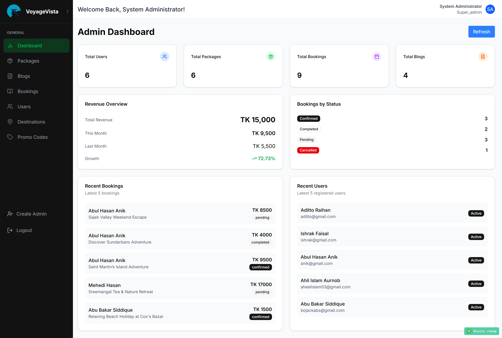

# 🌍 VistaVoyage — Modern Travel Booking Platform

<div align="center">


**A comprehensive full-stack travel booking platform built with cutting-edge technologies**

[](https://nextjs.org/)
[](https://fastapi.tiangolo.com/)
[](https://www.typescriptlang.org/)
[](https://www.postgresql.org/)
</div>

---

## 📸 Screenshots & Features
<div align="center">

|  |  |
|:-------------------------------------:|:----------------------------------------------:|
| **User Home Page**                    | **Packages**                                   |

|  |  |
|:----------------------------------------------:|:-------------------------------------------------------:|
| **User Booking**                               | **Destinations**                                        |

|  |  |
|:------------------------------------------:|:-------------------------------------------------:|
| **Travel Blogs**                           | **Admin Dashboard**                               |

|  |  |
|:-----------------------------------------:|:-------------------------------------------------:|
| **Admin User Management**                 | **Admin Booking Management**                      |

</div>

## ✨ Key Features

### 🎯 **Core Functionality**
- 🔐 **Dual Authentication System** - Separate login systems for users and administrators
- 🏖️ **Package Management** - Complete CRUD operations for travel packages
- 📅 **Advanced Booking System** - Full booking workflow with promo code support
- 💰 **Revenue Analytics** - Real-time financial tracking and reporting
- 🌍 **Destination Management** - Interactive destination browsing and management
- 📝 **Blog Platform** - Content management system for travel blogs

### 🚀 **Technical Excellence**
- ⚡ **Next.js 15 App Router** - Latest React framework with optimal performance
- 🐍 **FastAPI Backend** - High-performance Python API with automatic documentation
- 📊 **PostgreSQL Database** - Robust relational database with UUID primary keys
- 🎨 **Modern UI Design** - Beautiful interface with Tailwind CSS and ShadCN/UI
- 🔄 **Real-time Updates** - Dynamic content updates without page refreshes
- 📱 **Responsive Design** - Mobile-first approach with seamless cross-device experience

### 🛡️ **Security & Performance**
- 🔒 **JWT Authentication** - Secure token-based authentication with refresh tokens
- 🚀 **Redis Caching** - High-performance caching for optimal response times
- 🛡️ **Input Validation** - Comprehensive data validation with Pydantic schemas
- 📸 **File Management** - Secure image upload and management with Supabase
- 🔍 **SQL Injection Protection** - SQLModel ORM prevents security vulnerabilities
- ⚡ **Async Operations** - Full asynchronous support for scalable performance

---

## 🧱 Technology Stack

<div align="center">

| **Category** | **Technologies** | **Purpose** |
|--------------|------------------|-------------|
| **Frontend** |    | Modern web application framework |
| **Backend** |    | High-performance API development |
| **Database** |   | Data persistence and caching |
| **UI/UX** |    | Beautiful and responsive design |
| **Storage** |  | Scalable file and image management |
| **DevOps** |   | Containerization and database versioning |

</div>

---

## 🚀 Quick Start Guide

### 📋 Prerequisites

Before you begin, ensure you have the following installed:

- **Python 3.11+** - Backend development
- **Node.js 18+** - Frontend development  
- **PostgreSQL 15+** - Primary database
- **Redis 7.0+** - Caching and sessions
- **Git** - Version control

### ⚡ Setup

```bash
# Clone the repository
git clone https://github.com/Abs-Futy7/VistaVoyage.git
cd VistaVoyage

```
 

#### 1️⃣ **Environment Configuration**

Create environment files:

**Backend (.env)**
```env
# Database Configuration
DATABASE_URL=postgresql+asyncpg://<DB_USER>:<DB_PASSWORD>@<DB_HOST>:<DB_PORT>/<DB_NAME>

# JWT Secrets (change in production!)
JWT_SECRET_KEY=<your-jwt-secret-key>
JWT_ALGORITHM=HS256

# Redis
REDIS_HOST=<redis-host>
REDIS_PORT=<redis-port>

# Supabase Storage
SUPABASE_URL="https://<your-supabase-project>.supabase.co"
SUPABASE_KEY="<your-supabase-key>"

# Admin-specific configuration
ADMIN_JWT_SECRET_KEY=<your-admin-jwt-secret-key>
ADMIN_JWT_ALGORITHM=HS256
ADMIN_ACCESS_TOKEN_EXPIRE_MINUTES=120
ADMIN_REFRESH_TOKEN_EXPIRE_DAYS=7

# Default admin credentials (change these in production!)
DEFAULT_ADMIN_USERNAME=<admin-username>
DEFAULT_ADMIN_EMAIL=<admin-email>
DEFAULT_ADMIN_PASSWORD=<admin-password>
DEFAULT_ADMIN_FULL_NAME=<admin-full-name>

# Gmail/SMTP Configuration
GMAIL_USER=<your-gmail-address>
GMAIL_PASSWORD=<your-gmail-app-password>

SMTP_HOST=smtp.gmail.com
SMTP_PORT=587
SMTP_USERNAME=<your-smtp-username>
SMTP_PASSWORD=<your-smtp-password>
SMTP_FROM_EMAIL=<your-sender-email>
SMTP_FROM_NAME=<your-sender-name>
```

**Frontend (.env)**

```env
NEXT_PUBLIC_API_URL=http://localhost:8000
GOOGLE_GEMINI_API=YOUR_GEMINI_API
```

#### 2️⃣ **Backend Setup**

```bash
cd backend

# Create virtual environment
python -m venv env
source env/bin/activate  # Unix/macOS
# or
env\Scripts\activate     # Windows

# Install dependencies
pip install -r requirements.txt

# Setup database
createdb vistavoyage
alembic upgrade head

# Create admin user
python scripts/create_default_admin.py

# Start server
uvicorn src:app --reload --host 0.0.0.0 --port 8000
```

#### 3️⃣ **Frontend Setup**

```bash
cd frontend

# Install dependencies
npm install

# Start development server
npm run dev
```

#### 4️⃣ **Redis Setup**

```bash
# Using Docker (recommended)
docker run -d --name redis-vistavoyage -p 6379:6379 redis:alpine

```

</details>

---

## 📁 Project Architecture

```
VistaVoyage/
├── 🎨 frontend/                    # Next.js 15 Frontend Application
│   ├── app/                        # App Router Pages
│   │   ├── admin/                  # 🔧 Admin Dashboard
│   │   │   ├── dashboard/          # Analytics & Overview
│   │   │   ├── packages/           # Package Management
│   │   │   ├── bookings/           # Booking Management
│   │   │   ├── destinations/       # Destination Management
│   │   │   ├── blogs/              # Content Management
│   │   │   └── users/              # User Management
│   │   ├── user/                   # 👤 User Portal
│   │   │   ├── dashboard/          # User Overview
│   │   │   ├── bookings/           # Booking History
│   │   │   └── profile/            # Account Settings
│   │   ├── auth/                   # 🔐 Authentication
│   │   ├── packages/               # 🏖️ Package Browsing
│   │   ├── destinations/           # 🌍 Destination Explorer
│   │   ├── blogs/                  # 📝 Travel Blogs
│   │   └── about/                  # ℹ️ About & Contact
│   ├── components/                 # 🧩 Reusable Components
│   │   ├── ui/                     # ShadCN Base Components
│   │   ├── auth/                   # Authentication Components
│   │   ├── admin/                  # Admin-specific Components
│   │   └── booking/                # Booking Components
│   ├── lib/                        # 🛠️ Utilities & Services
│   │   └── api/                    # API Service Layer
│   └── hooks/                      # ⚡ Custom React Hooks
├── 🐍 backend/                     # FastAPI Backend Server
│   ├── src/                        # Source Code
│   │   ├── admin/                  # 🔧 Admin Routes & Auth
│   │   ├── auth/                   # 🔐 User Authentication
│   │   ├── user/                   # 👤 User-facing APIs
│   │   ├── home/                   # 🏠 Public APIs
│   │   ├── models/                 # 📊 Database Models
│   │   ├── schemas/                # ✅ Validation Schemas
│   │   ├── services/               # 🏗️ Business Logic
│   │   └── db/                     # 🗄️ Database Config
│   ├── alembic/                    # 🔄 Database Migrations
│   └── scripts/                    # 🛠️ Utility Scripts
└── 📋 docs/                        # 📚 Documentation
```

---

### 📊 **API Endpoints Overview**

<details>
<summary>📡 <strong>Authentication APIs</strong></summary>

```
🔐 User Authentication
├── POST   /api/v1/auth/register      # User registration
├── POST   /api/v1/auth/login         # User login
├── POST   /api/v1/auth/refresh       # Refresh tokens
├── GET    /api/v1/auth/profile       # Get user profile
└── PATCH  /api/v1/auth/profile       # Update profile

🛡️ Admin Authentication  
├── POST   /api/v1/admin/auth/login   # Admin login
├── POST   /api/v1/admin/auth/create  # Create admin
└── POST   /api/v1/admin/auth/refresh # Admin token refresh
```

</details>

<details>
<summary>🏖️ <strong>Package Management APIs</strong></summary>

```
📦 User Package Access
├── GET    /api/v1/user/packages      # Browse packages
└── GET    /api/v1/user/packages/{id} # Package details

🔧 Admin Package Management
├── GET    /api/v1/admin/packages     # List all packages
├── POST   /api/v1/admin/packages     # Create package
├── PUT    /api/v1/admin/packages/{id} # Update package
├── DELETE /api/v1/admin/packages/{id} # Delete package
└── PATCH  /api/v1/admin/packages/{id}/toggle # Toggle status
```

</details>

<details>
<summary>📅 <strong>Booking System APIs</strong></summary>

```
👤 User Bookings
├── GET    /api/v1/user/bookings      # User booking history
├── POST   /api/v1/user/bookings      # Create booking
├── GET    /api/v1/user/bookings/{id} # Booking details
└── PATCH  /api/v1/user/bookings/{id}/cancel # Cancel booking

🔧 Admin Booking Management
├── GET    /api/v1/admin/bookings     # All bookings
└── PATCH  /api/v1/admin/bookings/{id}/status # Update status
```

</details>

<details>
<summary>📊 <strong>Analytics & Dashboard APIs</strong></summary>

```
📈 Admin Dashboard
├── GET    /api/v1/admin/dashboard/stats # Dashboard overview
├── GET    /api/v1/admin/users          # User management
├── GET    /api/v1/admin/destinations   # Destination management
└── GET    /api/v1/admin/blogs          # Blog management
```

</details>

### 🔑 **Authentication Examples**

```javascript
// User Login
const response = await fetch('/api/v1/auth/login', {
  method: 'POST',
  headers: { 'Content-Type': 'application/json' },
  body: JSON.stringify({
    email: 'user@example.com',
    password: 'password123'
  })
});

// Admin Login  
const adminResponse = await fetch('/api/v1/admin/auth/login', {
  method: 'POST',
  headers: { 'Content-Type': 'application/json' },
  body: JSON.stringify({
    username: 'admin',
    password: 'admin123'
  })
});

// Authenticated Request
const data = await fetch('/api/v1/user/bookings', {
  headers: {
    'Authorization': `Bearer ${userToken}`,
    'Content-Type': 'application/json'
  }
});
```

---

## 👥 User Roles & Permissions

### 🔧 **Admin Capabilities**

<div align="center">

| Feature | Description | Permissions |
|---------|-------------|-------------|
| 📊 **Analytics Dashboard** | Real-time business metrics and insights | Full Access |
| 👤 **User Management** | Manage user accounts and permissions | CRUD Operations |
| 🏖️ **Package Management** | Create and manage travel packages | Full Control |
| 📅 **Booking Oversight** | Monitor and manage all bookings | Full Visibility |
| 🌍 **Destination Control** | Add and manage destinations | CRUD Operations |
| 📝 **Content Management** | Create and publish blog content | Publishing Rights |
| 🎫 **Promo Code System** | Create and manage discount codes | Full Control |
| 🖼️ **Media Management** | Upload and organize media files | File Management |

</div>

### 👤 **User Features**

<div align="center">

| Feature | Description | Access Level |
|---------|-------------|--------------|
| 🔍 **Package Discovery** | Browse and search travel packages | Public/Authenticated |
| 📅 **Booking System** | Complete booking workflow | Authenticated |
| 💳 **Payment Processing** | Secure payment handling | Authenticated |
| 📋 **Booking History** | View and manage bookings | Own Data Only |
| 👤 **Profile Management** | Update personal information | Own Profile |
| 🎟️ **Promo Code Usage** | Apply discount codes | During Booking |
| 📖 **Content Access** | Read blogs and guides | Public |


</div>

---

## 🗄️ Database Schema

### 📊 **Core Models**

<details>
<summary>👤 <strong>User Model</strong></summary>

```sql
CREATE TABLE users (
    id UUID PRIMARY KEY DEFAULT gen_random_uuid(),
    name VARCHAR(100) NOT NULL,
    email VARCHAR(255) UNIQUE NOT NULL,
    password_hash VARCHAR(255) NOT NULL,
    city VARCHAR(100),
    country VARCHAR(100),
    phone_number VARCHAR(20),
    passport_number VARCHAR(50),
    is_active BOOLEAN DEFAULT true,
    created_at TIMESTAMP DEFAULT NOW(),
    updated_at TIMESTAMP DEFAULT NOW()
);
```

</details>

<details>
<summary>🏖️ <strong>Package Model</strong></summary>

```sql
CREATE TABLE packages (
    id UUID PRIMARY KEY DEFAULT gen_random_uuid(),
    title VARCHAR(200) NOT NULL,
    description TEXT NOT NULL,
    price DECIMAL(10,2) NOT NULL,
    duration_days INTEGER NOT NULL,
    duration_nights INTEGER NOT NULL,
    destination_id UUID REFERENCES destinations(id),
    featured_image TEXT,
    gallery_images JSONB,
    is_featured BOOLEAN DEFAULT false,
    is_active BOOLEAN DEFAULT true,
    highlights TEXT,
    itinerary TEXT,
    inclusions TEXT,
    exclusions TEXT,
    max_group_size INTEGER,
    available_from DATE,
    available_until DATE,
    created_at TIMESTAMP DEFAULT NOW(),
    updated_at TIMESTAMP DEFAULT NOW()
);
```

</details>

<details>
<summary>📅 <strong>Booking Model</strong></summary>

```sql
CREATE TABLE bookings (
    id UUID PRIMARY KEY DEFAULT gen_random_uuid(),
    user_id UUID REFERENCES users(id),
    package_id UUID REFERENCES packages(id),
    total_amount DECIMAL(10,2) NOT NULL,
    discount_amount DECIMAL(10,2) DEFAULT 0,
    final_amount DECIMAL(10,2) NOT NULL,
    number_of_people INTEGER NOT NULL,
    travel_date DATE NOT NULL,
    promo_code_id UUID REFERENCES promo_codes(id),
    payment_status VARCHAR(20) DEFAULT 'pending',
    booking_status VARCHAR(20) DEFAULT 'confirmed',
    created_at TIMESTAMP DEFAULT NOW(),
    updated_at TIMESTAMP DEFAULT NOW()
);
```

</details>

 

---

## 🤝 Contributing

### 🌟 **How to Contribute**

1. **🍴 Fork** the repository
2. **🌿 Create** a feature branch: `git checkout -b feature/amazing-feature`
3. **💻 Make** your changes with proper testing
4. **✅ Test** your changes thoroughly  
5. **📝 Commit** with clear messages: `git commit -m 'Add amazing feature'`
6. **🚀 Push** to your branch: `git push origin feature/amazing-feature`
7. **🔄 Open** a Pull Request

### 📋 **Development Guidelines**

<details>
<summary>🎯 <strong>Code Standards</strong></summary>

#### **Backend (Python)**
- Follow PEP 8 style guidelines
- Use type hints for all functions
- Write comprehensive docstrings
- Implement proper error handling
- Follow SQLModel patterns

#### **Frontend (TypeScript)**
- Use TypeScript best practices
- Implement proper error boundaries
- Follow React hooks patterns
- Use ShadCN/UI components
- Maintain accessibility standards

</details>


---

## 🎯 Roadmap & Future Features

### 🚧 **Current & Upcoming Phase**
- ✅ Core platform with authentication
- ✅ Package and booking management  
- ✅ Admin dashboard with analytics
- ✅ Modern UI with responsive design
- 🔄 Payment gateway integration
- 🔄 Advanced search and filtering
- 🔄 Email notification system

### 🔮 **Planned Next Steps**
- Mobile app (React Native) & PWA support
- Push notifications
- Stripe payment integration
- Multi-language support (i18n)
- AI-powered recommendations
- Partner API integrations
- Group booking management
- Dynamic pricing
- Travel insurance partnerships
- Chatbot with NLP

---

## 🛡️ Security Features

### 🔐 **Authentication & Authorization**
- **JWT Token Security** - Secure token-based authentication
- **Role-Based Access Control** - Granular permission system
- **Password Security** - Bcrypt hashing with salt
- **Session Management** - Redis-based session handling
- **Token Rotation** - Automatic token refresh mechanism

### 🛡️ **Data Protection**
- **Input Validation** - Comprehensive Pydantic schemas
- **SQL Injection Prevention** - SQLModel ORM protection
- **XSS Protection** - Content Security Policy headers
- **CORS Configuration** - Secure cross-origin requests
- **Rate Limiting** - API abuse prevention

---

## 📚 Documentation & Resources
 

- **Next.js 15** - [Official Documentation](https://nextjs.org/docs)
- **FastAPI** - [User Guide](https://fastapi.tiangolo.com/)
- **SQLModel** - [Tutorial](https://sqlmodel.tiangolo.com/tutorial/)
- **Tailwind CSS** - [Documentation](https://tailwindcss.com/docs)
- **PostgreSQL** - [Official Docs](https://www.postgresql.org/docs/)

---

## 📄 License

<div align="center">

This project is licensed under the **MIT License** - see the [LICENSE](LICENSE) file for details.

[](https://opensource.org/licenses/MIT)

</div>

---

### 👥 **Development Team**

<div align="center">

### 🚀 Project Team

<table>
  <tr>
    <td align="center">
      
      <br />
      <sub><b>H.M. Mehedi Hasan</b></sub>
      <br />
      <a href="https://github.com/Mehedi26696">🐛 💻 📖</a>
      <br />
      <small>Full-Stack Developer</small>
    </td>
    <td align="center">
      
      <br />
      <sub><b>Abu Bakar Siddique</b></sub>
      <br />
      <a href="https://github.com/Abs-Futy7">💻 🎨 📱</a>
      <br />
      <small>Frontend Developer</small>
    </td>
  </tr>
</table>

</div>

## 🌟 Show Your Support

<div align="center">

If you find VistaVoyage helpful, please consider:

⭐ **Star** the repository | 🍴 **Fork** the project | 📢 **Share** with others | 🤝 **Contribute** code

[](https://github.com/Abs-Futy7/VistaVoyage/stargazers)
[](https://github.com/Abs-Futy7/VistaVoyage/network/members)

**Built with ❤️ for travelers around the world**

*Making travel booking simple, secure, and beautiful*

</div>

---

<div align="center">

**© 2025 VistaVoyage. Made with 💙 using Next.js and FastAPI**

</div>

---